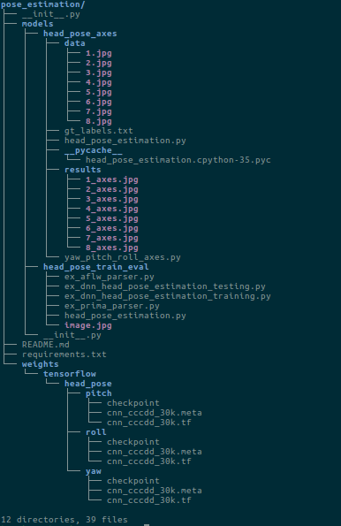

## Pose Estimation (Yaw, Pitch, Roll)

### How to Run:
* Download weight folder from the drive link [LInk](https://drive.google.com/drive/folders/16cXuQBml_bFmRnSIQF5eJtNdqwE1TWAK?usp=sharing) and put it in `pose_estimation` directory.
* The tree should be like this:
   * 
* `virtualvenv -p /usr/bin/python3.5 venv `
* `source venv/bin/activate`
* `pip install -r requirements.txt`
* `cd pose_estimation/models/head_pose_axes`
* Place the input data ( testing data) in `data` folder
* Places the ground truth labels for accuracy in `gt_labels.txt` file.
   * Format will be `<roll,pitch,yaw>`
   * ....................................................
   * ....................................................
   * .........................`<roll,pitch,yaw>`
* Now, run `python3 head_pose_estimation.py`
* Code will print Value of roll, pitch, yaw and Loss and Accuracy

##### Prediction is done using Convolution Neural Network (CNN)

##### Author: Gulshan Kumar

@Copyright Gulshan Kumar. **All rights reserved**